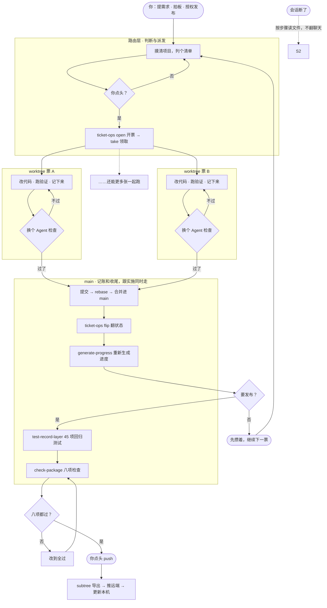

<!-- Input: 同级 `SKILL.md` 的定位、触发与主流程语义，Agent Up 产品定义（SPEC-01）的问题陈述与核心承诺，治理协议事实（三层定位与层权映射、记录层：状态索引/事实账本/状态投影、worktree 工作流、回归 harness 与八项包守卫），GitHub 发布事实（`https://github.com/ynotoony/agent-up.git`），用户 Review 口径（v7：固定双节标题与"做了xxx"句式、简单易懂；2026-09-20 v10：新增三层骨架节、mermaid 流程图替换文字版并体现并行与工具调用、模块地图不出图、数字除名）。 -->
<!-- Output: 公开包的固定双节问题与方案陈述（问题 6 条、方案 8 条"做了"句式）、三层骨架节、mermaid 运作流程图（含循环、并行与工具调用）、安装与使用方式。 -->
<!-- Pos: 公开包入口说明（面向人的目录索引，不承载可执行规则）；一旦我被更新，务必更新我的开头注释，以及所属文件夹的 README.md。 -->

# Agent Up

> 对 Agent 友好，而非人类友好。

## 你可能已经遇到了这些问题

1. 让 Agent 改个功能，它不看项目情况，上来就改，方向错了你才发现。
2. 昨天干到一半，今天新开会话，它什么都不记得，你只能从头再讲一遍。
3. 同一个状态它记在三个地方，改了两处忘一处，过两天问题自己冒出来。
4. 它说"做完了"，可验证记录呢？没有。检查过吗？也没有。
5. 让它顺手改点东西，改坏了别的功能，谁都不知道。
6. 你提的新需求记在聊天里，过两天就忘了。

## 因此我们做了这些事情

1. **先立规矩**：它上来先把你的项目摸一遍，列个清单给你，你点头了才让它改。它不替你写代码，也不瞎猜你想要啥。
2. **分开干活**：写代码、检查、提交，是三个不同的 Agent 轮流来。写代码的不给自己打分，检查不过就不能提交。
3. **状态只记一处**：一个任务的状态就写在一个文件里，别处看到的全是它自动生成的，对不对得上机器会查。少改了一处？机器先叫。
4. **记流水账**：干了什么、为啥这么干，一条一条记下来，记了就不许动。以后扯皮，翻账本。
5. **断了不怕**：会话断了就断了。新会话按步骤把文件读一遍、验证重跑一遍，接着上次干。
6. **需求先排队**：你说"加个需求"，它先记下来排上队，不打断手头的活。你提过的，都有下文。
7. **用到再装**：一开始只装几件必需的。要用票了装票务，要画图了装生成器。老项目只补缺的，不动你已有的。
8. **自带体检**：装完就带八项检查和一套回归测试。少了什么、改坏了什么，跑一条命令全知道。

## 它的骨架：三层

- **路由层**管判断：这活多大、怎么干，它说了不算，按规矩来。规矩没写的，它来问你。
- **编码层**管动手：写代码、检查、提交分开换人。能省的省，该验的一样不少。
- **文档层**管记忆：东西都写在文件里，有脚本看着。会话会没，文件不会。

你要做的就三件事：提需求、看结果、点发布。

## 怎么运作

每个任务都这么跑，几张票还能同时来：



几张票同时跑时，一票一个工作区，谁也不碰谁的文件。记账和收尾在主线上，跟实施同时走。开工前先看看哪张票有人在干，撞了就换号。不自动 push，不自动部署——发不发，你说了算。

## 安装

前置条件：你的 Agent 支持加载 Skills。

```bash
git clone https://github.com/ynotoony/agent-up.git ~/.agents/skills/agent-up
```

装完即用，不用任何配置。以后想升级，进这个目录 `git pull` 拉最新版就行。

## 使用

在项目里输入 `/agent-up`。第一次：它把项目摸一遍、列个清单、你确认、装好。之后每个任务都走这套流程；断了就说"继续剩余任务"；加需求，新开会话说"加个需求"；心里没底，跑一下自带的自检。

## License

[MIT](LICENSE)。
